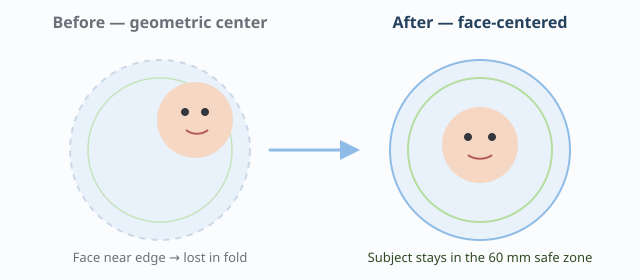

# PinTori

**Live demo:** [https://frankmo89.github.io/PinTori/](https://frankmo89.github.io/PinTori/) · **Debug overlay:** [?debug=1](https://frankmo89.github.io/PinTori/?debug=1)

Static app (HTML/CSS/JS, no backend) that turns photos into a print-ready pinback sheet. No accounts, no uploads — everything runs in the browser. Built so a kid can use it alone.

Full product spec: `SPEC.md`. Design system (pastel): `DESIGN.md`. Default geometry: **70 mm cut / 60 mm finished**.

---

## 15-second demo

1. Open the [live demo](https://frankmo89.github.io/PinTori/).
2. Tap **Start** (or **Try with demo photo** to load a sample into the first slot).
3. Tap an empty circle → add your own photo (or keep the demo).
4. Drag / pinch to fine-tune; the dimmed ring is the fold-under zone.
5. Tap **Generate PDF** → print at **100%** scale and check the calibration ruler on the sheet against a real ruler before cutting.



---

## Case study (portfolio)

### Problem

Making pinback buttons at home usually means Canva/Photoshop templates or guesswork. Kids (and adults) hit the same four failures: print scale ("fit to page"), faces lost in the fold-under bleed, off-center cuts, and wrong paper. PinTori designs against those failures — not with a help page, but with geometry and UI that make the right outcome the easy one.

### Approach

- **Client-only** static app: Canvas + jsPDF, no accounts, no uploads.
- **Visible fold ring** while adjusting circle slots so important content stays inside the finished 60 mm face.
- **Calibration ruler** on every exported sheet (cm + inches) so scale is physically verifiable.
- **Auto framing**: scored candidates (face-api TinyFaceDetector / smartcrop / geometric) with edge penalty; local only. Silent fallbacks. `?debug=1` overlay.

### face-api vs MediaPipe (MB tradeoff)

MediaPipe Tasks Vision looked like the "default modern" choice until we weighed the binaries: ~11.4 MB deferred vs ~0.85 MB for face-api.js TinyFaceDetector. For "where is the face so we can center a crop," the extra MediaPipe precision is invisible on a phone; the download is not. We measured, then inverted the original plan. Full tables live under Technical details below.

### Privacy

Photos never leave the device. Models are vendored under `vendor/` — no CDN, no API calls. Detection runs on a downscaled canvas copy (320 px / 256 px), not the full-resolution original.

### Print accuracy

Default mold measured to **70 mm cut / 60 mm finished / 60 mm safe zone** (not a generic bleed formula). Export is always 300 DPI. The printed ruler was physically confirmed against a steel ruler (2026-08-10).

---

## Technical details

### Auto framing (the AI/ML piece)

When a photo is added to a slot, PinTori finds the subject and uses that to choose the initial crop center — instead of always using the geometric midpoint, which is rarely where the subject is on an unedited phone photo. Each signal is a **scored candidate**; the highest score wins (not a blind cascade face → smartcrop → 0,0):

1. **Human face** — face-api.js (TinyFaceDetector). Multi-face: center of the *group* bbox (union of all faces); `conf` = max score.
2. **Generic subject** — smartcrop.js (always evaluated, not only when face fails). Drawings, anime, pets, objects, landscapes.
3. **Geometric center** — always available as fallback (offset 0,0).

### Scoring formula

```
score = wFace * faceConf + wSal * saliencyScore - wEdge * edgePenalty
```

Weights: `wFace=1`, `wSal=0.5`, `wEdge=0.8` — faces dominate when present; smartcrop is useful but noisier; edge penalty uses cut vs safe-zone geometry so centers hugging the image border (fold/bleed risk) lose. See `js/face/centerScoring.js`.

### Debug overlay

Open with `?debug=1` (or set `localStorage` / `sessionStorage` key `pintori-debug=1`). `?debug=0` disables. While editing a photo slot, the canvas shows cut / safe / fold rings, face bboxes, the winning center label + score, and a small HUD (Default 70/60 mm, `px = mm * DPI/25.4`). Hidden for normal users; never drawn on export/print.

### What happens in practice

1. A photo is added (`<input type="file">` — no camera stream, no upload).
2. Before showing it in the slot, the image is copied to a small helper canvas (320 px for face-api.js, 256 px for smartcrop.js). Detection runs on that copy — not on the original multi-MB file.
3. Faces are detected (if any) and, in parallel, smartcrop.js estimates a saliency center. Both plus the geometric center enter the scorer.
4. The highest `score` wins (formula above). The winning point becomes `offsetXFrac` / `offsetYFrac` via `computeFaceCenteredOffset`.
5. If face and smartcrop fail to load, only geometric (0,0) remains — never worse than the historical default.
6. The user can still drag and zoom afterward — detection only sets the starting point.
7. With `?debug=1`, the slot overlay shows cut/safe/fold rings, bboxes, and the winner label/score (editor only, never on export).

There is no "enable AI" button and no "✨ AI" badge. If it works, the photo simply lands well framed. If nothing is detected, it centers as before. The flow is never blocked.

### Model: face-api.js (TinyFaceDetector), not MediaPipe

The original plan considered MediaPipe Face Detector first and face-api.js as backup. That was inverted after measuring real download weight:

| | MediaPipe Tasks Vision | face-api.js |
|---|---|---|
| Runtime | ~11.2 MB (generic WASM for the whole vision task family — no face-only build) | — |
| JS + model | ~155 KB + ~225 KB | ~660 KB (includes its own TensorFlow.js engine) + ~190 KB |
| **Deferred total** | **~11.4 MB** | **~0.85 MB** |

For this job — find where a face is to center a crop, not who it is or what expression — MediaPipe’s extra precision does not show up on a phone; the 13× weight does. Detection uses **TinyFaceDetector**, the lightest face-api.js model (~190 KB of 8-bit quantized weights).

### Fallback: smartcrop.js, not a second trained model

When face-api.js finds no face (drawings, anime, pets, objects, landscapes), a second pass uses **smartcrop.js** — classical vision (edges + skin tone + saturation), not a trained network. Compared against two deep-learning options with the same “measure, don’t assume” rule:

| | smartcrop.js | coco-ssd (TFJS) | U2Netp + onnxruntime-web |
|---|---|---|---|
| What it is | Classical heuristic, no NN | Object detection, 80 COCO classes | Trained generic saliency net |
| Model | None — code only | `lite_mobilenet_v2`: &lt;1 MB | ~4.7 MB |
| Runtime | None, pure JS | `@tensorflow/tfjs` — a **second** TFJS engine (does not share face-api’s) | onnxruntime-web WASM: ~3–8 MB even “minimal” |
| **Deferred total** | **~17 KB** | **~1.5–2.3 MB** (est.) | **~8–13 MB** |
| Drawings / anime | Usually yes | No — only its 80 classes | Yes, generic |

U2Netp+onnxruntime lands in the same weight class as MediaPipe (~11.4 MB), already rejected for the same reason. coco-ssd fails the motivating case — a drawing or anime character is none of its 80 classes. smartcrop.js is ~50× lighter than face-api.js itself and adds no new runtime.

Honest caveat: smartcrop.js is less precise than a trained saliency model and can fail on high-contrast backgrounds that are not the subject. The real comparison is against pure geometric center (what existed before); against that it usually helps at near-zero cost, and if it fails it falls back to the same center.

### Fully local, no network

- `vendor/face-api/`, `vendor/smartcrop/`, and `vendor/jspdf/` are vendored — no CDN in production. Zero API calls.
- Models never see the full-resolution original — only the local downscaled copy (320 px / 256 px). The image never leaves the device.

### Deferred load

Face and saliency scripts/models are not touched until after first paint — `js/main.js` warms both with `requestIdleCallback` (with `setTimeout` fallback for Safari). Their weight never competes with initial open. If the user adds a photo before warmup finishes, detection waits for load — no second code path.

### Where the code lives

- `js/face/faceDetect.js` — deferred load + detection; group center + bboxes/`conf` (or `null`). Exports `downscaleForDetection`.
- `js/face/saliencyDetect.js` — smartcrop.js: center + normalized `conf`.
- `js/face/centerScoring.js` — candidates, score formula, edge penalty (cut vs safe), multi-face policy (group bbox).
- `js/editor/photoLoader.js` — runs face+saliency in parallel, picks winner, stores `photo.centerDebug` for the overlay.
- `js/debug.js` + `js/editor/debugOverlay.js` — `?debug=1` flag and rings/bboxes/HUD (editor only).
- `js/render.js` (`computeFaceCenteredOffset`) — maps winning center to offset; same math for editor and export.

---

## Project structure

```
index.html
styles/          tokens, base, editor, modal, hero
js/
  constants.js   pin + sheet size tables (SPEC §3)
  geometry.js    mm → px, grid layout
  render.js      single draw path for editor + export
  state.js       per-slot editor state
  i18n.js        es/en dictionary + language toggle
  main.js        boot, persistence, idle warmup
  editor/        slot grid, drag/zoom, debug overlay
  face/          auto framing (face + saliency + scoring)
  export/        300 DPI sheet compose + PDF/PNG/share
vendor/          face-api, smartcrop, jsPDF (vendored on purpose)
```

---

## Run locally

No build step and no npm install. Serve over HTTP — **do not open `index.html` via double-click**: ES modules and model `fetch()` fail under `file://` due to browser CORS rules.

```bash
python3 -m http.server 8934
```

Open `http://localhost:8934/`.

---

## Deploy

**GitHub Pages** (current live URL): publish `main` from `/` (root).

**Cloudflare Pages** (optional): Framework preset `None`, empty build command, output directory `/`. Or:

```bash
npx wrangler pages deploy . --project-name=pintori
```
